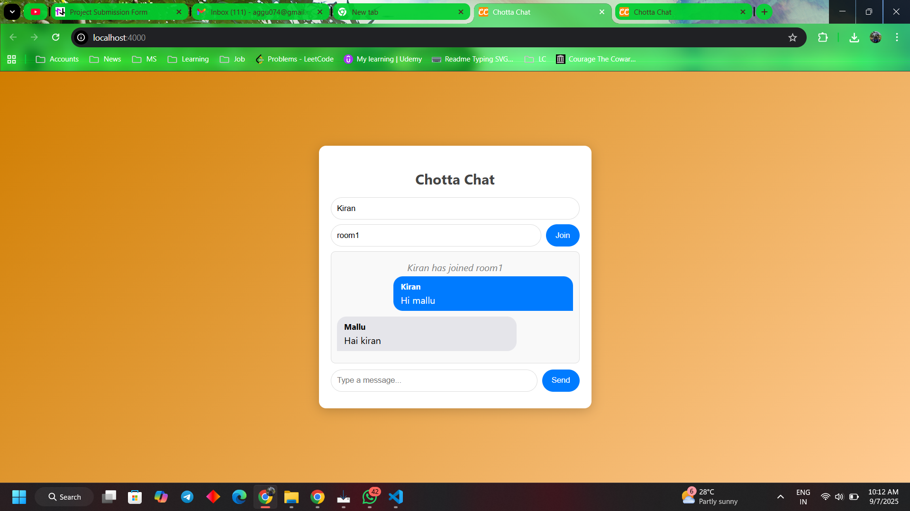

# 💬 Chotta Chat


  
  

Chotta Chat is a simple real-time chat application built using **Node.js**, **Express**, and **Socket.io**.  
It allows users to join chat rooms, send messages instantly, and see system notifications when users join or leave.  

---

## 🚀 Features
- 🔑 Join any chat room with a username  
- 💬 Real-time messaging (via Socket.io)  
- ↔️ Multiple users in the same room  
- ⌨️ Press Enter to send messages  
- 📤 Disconnect button with proper system message  
- 🎨 Modern, clean, responsive UI  
- 🖼️ Custom favicon support  

---

## 🛠️ Tech Stack
- **Frontend:** HTML, CSS, Vanilla JavaScript  
- **Backend:** Node.js, Express.js  
- **Real-Time Communication:** Socket.io  

---

## 📂 Project Structure
```

chotta-chat/
│── server.js        # Backend server
│── package.json
│── /public
│── index.html   # Chat frontend
│── favicon.ico  # App icon

````

---

## ⚡ Installation & Usage

1. Clone this repository:
   git clone https://github.com/your-username/chotta-chat.git
   cd chotta-chat

2. Install dependencies:

   ```bash
   npm install
   ```

3. Run the server:

   ```bash
   node server.js
   ```

4. Open the app in your browser:

   ```
   http://localhost:3000
   ```

---

## 🎯 Demo

Open two browser tabs, join the same room with different usernames, and start chatting in real-time!


## 🙌 Credits

This project was built as part of my learning journey with **TechnoHacks**.
Special thanks to my mentor **Sandip Gavit** for the guidance and support.


## 📜 License

This project is open-source and available under the **MIT License**.

